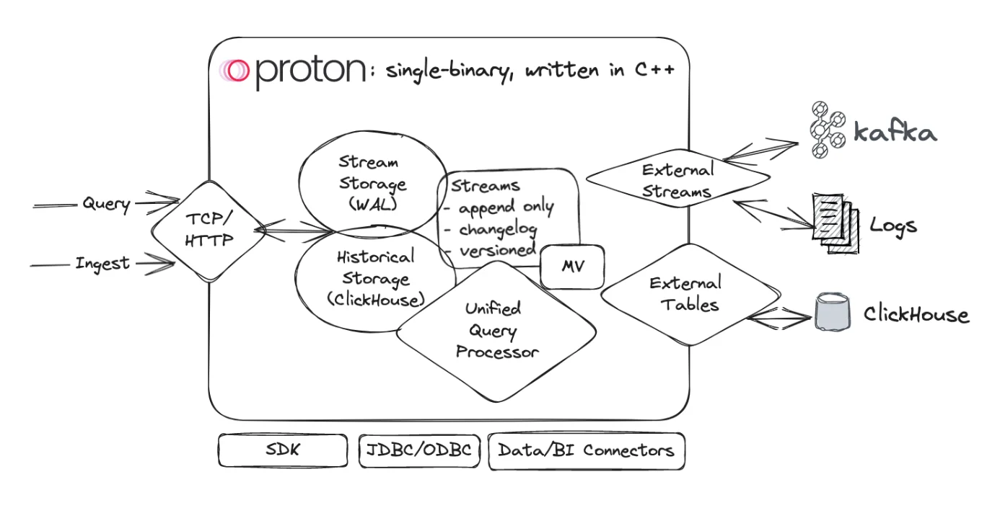

<p align="center">
   <br/>
  <b> A fast and lightweight streaming SQL engine, 🚀 powered by ClickHouse</b> <br/><br/>
  📄 <a href="https://docs.timeplus.com/proton" target="_blank">Documentation</a>&nbsp;&nbsp;
  🚀 <a href="https://demo.timeplus.cloud/" target="_blank">Live Demo</a>&nbsp;&nbsp;
  🌎 <a href="https://timeplus.com/" target="_blank">Timeplus</a> <br/><br/>
  <a href="https://github.com/timeplus-io/proton/"></a>&nbsp;
  <a href="https://github.com/timeplus-io/proton/pkgs/container/proton"></a>&nbsp;
  <a href="https://github.com/timeplus-io/proton/blob/develop/LICENSE"></a>&nbsp;
  <a href="https://www.youtube.com/@timeplusdata"></a>&nbsp;
  <a href="https://timeplus.com/slack"></a>&nbsp;
  <a href="https://linkedin.com/company/timeplusinc"></a>&nbsp;
  <a href="https://twitter.com/intent/follow?screen_name=timeplusdata"></a>&nbsp;
  <a href="https://github.com/timeplus-io/proton/blob/develop/LICENSE"></a>&nbsp;
</p>

<p align="center">
  <a href="#-why-use-timeplus-proton"><strong>Why Use Timeplus Proton</strong></a> ·
  <a href="#-demo-video"><strong>Demo Video</strong></a> ·
  <a href="#-deployment"><strong>Deployment</strong></a> ·
  <a href="#-whats-next"><strong>What's Next</strong></a> ·
  <a href="#-integrations"><strong>Integrations</strong></a> ·
  <a href="#contributing"><strong>Contributing</strong></a> ·
  <a href="#need-help"><strong>Need help?</strong></a>
</p>

Timeplus Proton is a streaming SQL engine, a fast and lightweight alternative to ksqlDB or Apache Flink, 🚀 powered by ClickHouse. It enables developers to solve streaming data processing, routing and analytics challenges from Apache Kafka, Redpanda and more sources, and send aggregated data to the downstream systems. Timeplus Proton is the core engine of [Timeplus Enterprise](https://timeplus.com).

## 💪 Why use Timeplus Proton?

1. **[Apache Flink](https://github.com/apache/flink) or [ksqlDB](https://github.com/confluentinc/ksql) alternative.** Timeplus Proton provides powerful streaming SQL functionalities, such as streaming ETL, tumble/hop/session windows, watermarks, materialized views, CDC and data revision processing, etc.
2. **Fast.** Timeplus Proton is written in C++, with optimized performance through SIMD. [For example](https://www.timeplus.com/post/scary-fast), on an Apple MacBookPro with M2 Max, Timeplus Proton can deliver 90 million EPS, 4 millisecond end-to-end latency, and high cardinality aggregation with 1 million unique keys.
3. **Lightweight.** Timeplus Proton is a single binary (\<500MB). No JVM or any other dependencies. You can also run it with Docker, or on an AWS t2.nano instance (1 vCPU and 0.5 GiB memory).
4. **Powered by the fast, resource efficient and mature [ClickHouse](https://github.com/clickhouse/clickhouse).** Timeplus Proton extends the historical data, storage, and computing functionality of ClickHouse with stream processing. Thousands of SQL functions are available in Timeplus Proton. Billions of rows are queried in milliseconds.
5. **Best streaming SQL engine for [Kafka](https://kafka.apache.org/) or [Redpanda](https://redpanda.com/).** Query the live data in Kafka or other compatible streaming data platforms, with [external streams](https://docs.timeplus.com/proton-kafka).


See our [architecture](https://docs.timeplus.com/proton-architecture) doc for technical details and our [FAQ](https://docs.timeplus.com/proton-faq) for more information.

## 🎬 Demo Video

2-minute short video👇. Check out [the full video at YouTube](https://youtu.be/vi4Yl6L4_Dw?t=283).

https://github.com/timeplus-io/proton/assets/5076438/8ceca355-d992-4798-b861-1e0334fc4438

## ⚡ Deployment

### A single binary:

```shell
curl https://install.timeplus.com/oss | sh
```
Once the `proton` binary is available, you can run Timeplus Proton in different modes:

- **Local Mode.** You run `proton local` to start it for fast processing on local and remote files using SQL without having to install a full server
- **Config-less Mode.** You run `proton server` to start the server and put the config/logs/data in the current folder `proton-data`. Then use `proton client` in the other terminal to start the SQL client.
- **Server Mode.** You run `sudo proton install` to install the server in predefined path and a default configuration file. Then you can run `sudo proton server -C /etc/proton-server/config.yaml` to start the server and use `proton client` in the other terminal to start the SQL client.

For Mac users, you can also use [Homebrew](https://brew.sh/) to manage the install/upgrade/uninstall:

```shell
brew install timeplus-io/timeplus/proton
```

### Docker:

```bash
docker run -d --pull always -p 8123:8123 -p 8463:8463 --name proton d.timeplus.com/timeplus-io/proton:latest
```

Please check [Server Ports](https://docs.timeplus.com/proton-ports) to determine which ports to expose, so that other tools can connect to Timeplus, such as DBeaver.

### Docker Compose:

The [Docker Compose stack](https://github.com/timeplus-io/proton/tree/develop/examples/ecommerce) demonstrates how to read/write data in Kafka/Redpanda with external streams.

### Timeplus Cloud:

Don't want to setup by yourself? Try Timeplus in [Cloud](https://us-west-2.timeplus.cloud/)


### 🔎 Usage
SQL is the main interface. You can start a new terminal window with `proton client` to start the SQL shell.
> [!NOTE]
> You can also integrate Timeplus Proton with Python/Java/Go SDK, REST API, or BI plugins. Please check <a href="#-integrations"><strong>Integrations</strong></a>

In the `proton client`, you can write SQL to create [External Stream for Kafka](https://docs.timeplus.com/proton-kafka) or [External Table for ClickHouse](https://docs.timeplus.com/proton-clickhouse-external-table).

You can also run the following SQL to create a stream of random data:

```sql
-- Create a stream with random data
CREATE RANDOM STREAM devices(
  device string default 'device'||to_string(rand()%4),
  temperature float default rand()%1000/10);

-- Run the streaming SQL
SELECT device, count(*), min(temperature), max(temperature)
FROM devices GROUP BY device;
```

You should see data like the following:

```
┌─device──┬─count()─┬─min(temperature)─┬─max(temperature)─┐
│ device0 │    2256 │                0 │             99.6 │
│ device1 │    2260 │              0.1 │             99.7 │
│ device3 │    2259 │              0.3 │             99.9 │
│ device2 │    2225 │              0.2 │             99.8 │
└─────────┴─────────┴──────────────────┴──────────────────┘
```

### ⏩ What's next?
To see more examples of using Timeplus Proton, check out the [examples](https://github.com/timeplus-io/proton/tree/develop/examples) folder.

To access more features, such as sources, sinks, dashboards, alerts, and data lineage, try [Timeplus Enterprise](https://www.timeplus.com/product) locally or create a workspace on [Timeplus Cloud](https://us-west-2.timeplus.cloud).

What features are available with Timeplus Proton versus Timeplus Enterprise?

|                               | **Timeplus Proton**                                                                                                                                                                    | **Timeplus Enterprise**                                                                                                                                                                                                          |
| ----------------------------- | -------------------------------------------------------------------------------------------------------------------------------------------------------------------------------------- | -------------------------------------------------------------------------------------------------------------------------------------------------------------------------------------------------------------------------------- |
| **Deployment**                | <ul><li>Single-node Docker image</li><li>Single binary on Mac/Linux</li></ul>                                                                                                          | <ul><li>Single node, or</li><li>Cluster</li><li>Kubernetes-based self-hosting, or</li><li>Fully-managed cloud service</li></ul>                                                                               |
| **Data sources**              | <ul><li>Random streams</li><li>External streams to Apache Kafka, Confluent Cloud, Redpanda</li><li>Streaming ingestion via REST API (compact mode only)</li></ul> | <ul><li>Everything in Timeplus Proton</li><li>External streams to another Timeplus Proton or Timeplus Enterprise deployment</li><li>WebSocket and HTTP Stream</li><li>NATS</li><li>CSV upload</li><li>Streaming ingestion via REST API (with API key and flexible modes)</li><li>Hundreds of connectors from Redpanda Connect</li></ul> |
| **Data destinations (sinks)** | <ul><li>External streams to Apache Kafka, Confluent Cloud, Redpanda</li></ul>                                                                                                          | <ul><li>Everything in Timeplus Proton</li><li>External streams to another Timeplus Proton or Timeplus Enterprise deployment</li><li>Slack</li><li>Webhook</li><li>Hundreds of connectors from Redpanda Connect</li></ul>                                                                                                      |
| **Support**                   | <ul><li>Community support from GitHub and Slack</li></ul>                                                                                                                              | <ul><li>Enterprise support via email, Slack, and Zoom, with a SLA</li></ul>                                                                                                                                                      |

## 🧩 Integrations
The following drivers are available:

* https://github.com/timeplus-io/proton-java-driver JDBC and other Java clients
* https://github.com/timeplus-io/proton-go-driver
* https://github.com/timeplus-io/proton-python-driver

Integrations with other systems:

* ClickHouse https://docs.timeplus.com/proton-clickhouse-external-table
* Docker and Testcontainers https://docs.timeplus.com/tutorial-testcontainers-java
* Sling https://docs.timeplus.com/sling
* Grafana https://github.com/timeplus-io/proton-grafana-source
* Metabase  https://github.com/timeplus-io/metabase-proton-driver
* Pulse UI https://github.com/timeplus-io/pulseui/tree/proton
* Homebrew https://github.com/timeplus-io/homebrew-timeplus
* dbt https://github.com/timeplus-io/dbt-proton

## Documentation

We publish full documentation for Timeplus Proton at [docs.timeplus.com](https://docs.timeplus.com/proton) alongside documentation for Timeplus Enterprise.

We also have a [FAQ](https://docs.timeplus.com/proton-faq/) for detailing how we chose Apache License 2.0, how Timeplus Proton is related to ClickHouse, and more.

## Contributing

We welcome your contributions! If you are looking for issues to work on, try looking at [the issue list](https://github.com/timeplus-io/proton/issues).

Please see the [wiki](https://github.com/timeplus-io/proton/wiki/Contributing) for more details, and [BUILD.md](https://github.com/timeplus-io/proton/blob/develop/BUILD.md) to compile Timeplus Proton in different platforms.

## Need help?

Please use [GitHub Discussions](https://github.com/timeplus-io/proton/discussions) to share your feedbacks or questions for Timeplus Proton.

For filing bugs, suggesting improvements, or requesting new features, open [GitHub Issues](https://github.com/timeplus-io/proton/issues).

To connect with Timeplus engineers or inquire about Timeplus Enterprise, join our [Timeplus Community Slack](https://timeplus.com/slack).

## Licensing

Proton uses Apache License 2.0. See details in the [LICENSE](https://github.com/timeplus-io/proton/blob/master/LICENSE).
