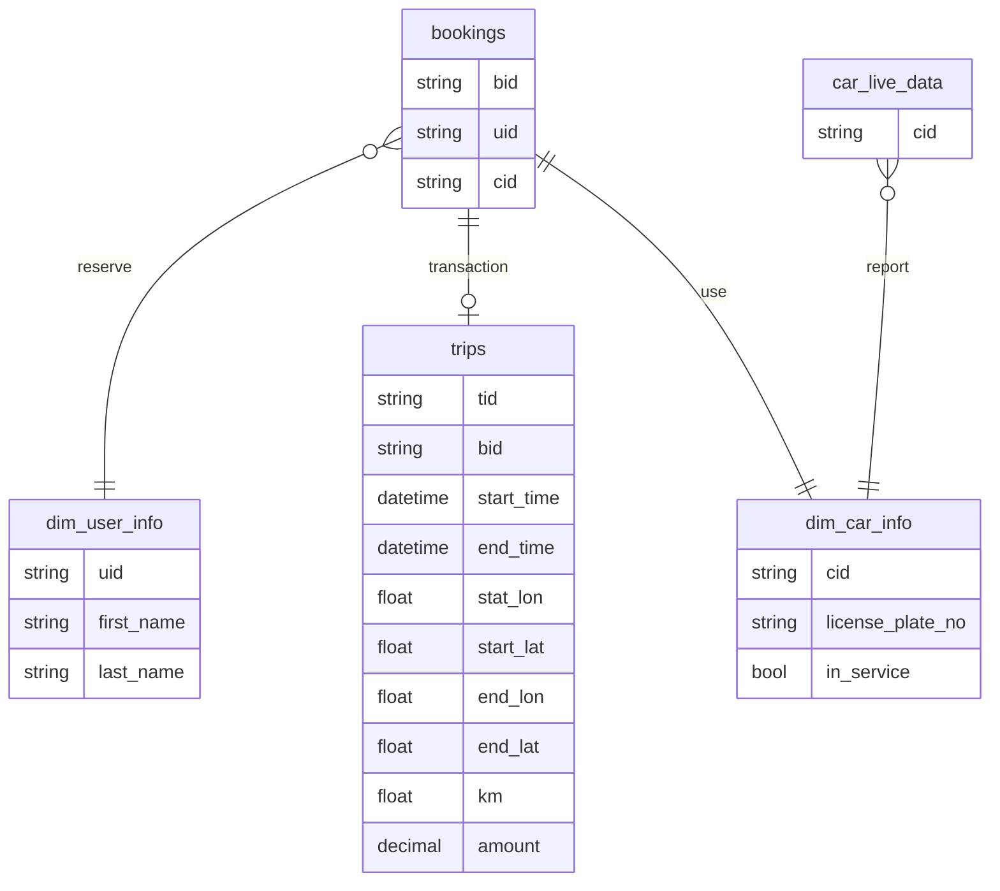

# Demo for Carsharing Use Case


This docker compose file demonstrates some typical query patterns that you can achieve in Proton to solve various use cases.

For more details, please check https://docs.timeplus.com/usecases


## Start the example

Simply run `docker compose up` in this folder. Two docker containers in the stack:

1. d.timeplus.com/timeplus-io/proton:latest, as the streaming database
2. timeplus/cardemo:latest, as the data generator

## Customer Scenario and Data Model

You are the lead business analyst in a carsharing company. Sensors are equipped in each car to report car locations. The customers use the mobile app to find available cars nearby, book them, unlock them and hit the road. At the end of the trip, the customer parks the car, locks it, and ends the trip. The payment will proceed automatically with the registered credit card.

Some of the typical use cases for time-sensitive insights are:

- How many cars are being driven by users in certain locations? Do we need to move some cars from less busy locations to those hot zones?
- Which cars are being driven too fast or running low on fuel? The service team may need to take action.
- Which users keep booking cars then canceling them? Shall we send real-time notification to those users to avoid abuse.

There are multiple data streams in the systems:





## Sample queries

Please check https://docs.timeplus.com/usecases for more sample queries.

```sql
-- List live data
SELECT * FROM car_live_data;

-- Filter data
SELECT time,cid,gas_percent FROM car_live_data WHERE gas_percent < 25;

-- Downsampling
SELECT window_start,cid, avg(gas_percent) AS avg_gas_percent,avg(speed_kmh) AS avg_speed FROM
tumble(car_live_data,1m) GROUP BY window_start, cid;

-- Create materlized view
CREATE MATERIALIZED VIEW car_live_data_1min as
SELECT window_start AS time,cid, avg(gas_percent) AS avg_gas,avg(speed_kmh) AS avg_speed
FROM tumble(car_live_data,1m) GROUP BY window_start, cid;
SELECT * FROM car_live_data_1min;

-- Top K
SELECT window_start,top_k(cid,3) AS popular_cars FROM tumble(bookings,1h) GROUP BY window_start;

-- JOIN
SELECT avg(gap) FROM
( SELECT
    date_diff('second', bookings.booking_time, trips.start_time) AS gap
  FROM bookings
  INNER JOIN trips ON (bookings.bid = trips.bid)
     AND date_diff_within(2m, bookings.booking_time, trips.start_time)
) WHERE _tp_time >= now()-1d;

```
