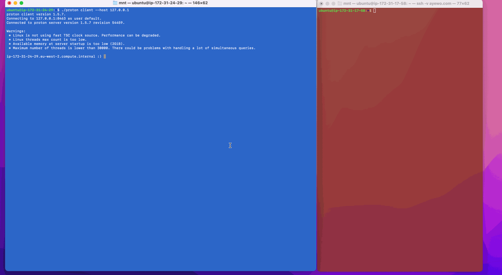

# Analyzing Nginx Access Logs using Timeplus Proton 
In a [recent blog post](https://www.timeplus.com/post/log-stream-analysis), we walked through three different ways of using Timeplus Proton to ingest and analyse a log file in real-time.

In this post, I will use Timeplus Proton to show how to perform: 
* real-time analysis of web traffic 
* historical analysis of web traffic
  
I will use an Nginx web server for the analysis.
 

## Introducing a New Contender for SQL-based Observability
[SQL-based Observability](https://clickhouse.com/blog/the-state-of-sql-based-observability#is-sql-based-observability-applicable-to-my-use-case) is steadily growing in popularity as an alternative to the [ELK stack](https://aws.amazon.com/what-is/elk-stack/) and the major tool at the center of this trend is ClickHouse due to its blazing-fast log-handling features. 

Two metrics that help ClickHouse stand out relative to alternatives are:
* ingestion speed and
* query speed.

For instance, Uber's Log Analytics platform, which used to be based on ELK, could only handle [~25.5k docs per second](https://www.elastic.co/blog/data-ingestion-elasticsearch) compared to an ingestion speed of [300K logs per second](https://www.uber.com/en-PT/blog/logging/) on a single ClickHouse node.

More than 80% of their queries are aggregation queries but ELK was not designed to support fast aggregations across large datasets. This lead to very slow query speeds for aggregation queries over a 1-hour window (on a 1.3TB dataset) and frequent time outs for aggregations over a 6-hour window. 

ClickHouse's columnar design allows it to support fast aggregations across large datasets out-of-the-box. The Uber team were able to further speedup the execution time of aggregation queries on ClickHouse by *materializing frequently queried fields into their own columns*. The historical analysis in the second part of this blog will make use of this technique.

Timeplus Proton extends the already excellent log-handling features of ClickHouse with streaming making it a perfect candidate for our first and second tasks: real-time traffic analysis and historical traffic analysis. 

## Background
The blog that we will using is my personal blog which I launched back in 2020. It's a [Ghost](https://ghost.org/) blog hosted on AWS. Ghost is written in JavaScript/Node.js and is completely [open source](https://github.com/tryghost/ghost).

In production, the Ghost blog is deployed behind Nginx which serves as a reverse proxy, so the Ghost blog is in fact two services: 
* a Node.js web app that listens on port `2368`
* an Nginx web server that listens for incoming traffic on the standard HTTP/HTTPS ports `80` and `443`. It handles SSL termination for the Node.js app. 

The Nginx access logs are regularly rotated so I have multiple rotated log files dating back to 4 years ago when the blog was first launched in `/var/log/nginx/`.

<details>
<summary>Nginx logs directory listing.</summary>
<pre>
ll /var/log/nginx/
total 2152
drwxr-xr-x  3 root     adm      4096 Apr 30 00:00 ./
drwxrwxr-x 13 root     syslog   4096 Apr 28 00:00 ../
drwxr-xr-x  2 www-data adm      4096 Apr 28 16:42 2020-10_2023-06/
-rw-r-----  1 www-data adm    418174 Apr 30 22:36 access.log
-rw-r-----  1 www-data adm    799201 Apr 29 23:59 access.log.1
-rw-r-----  1 www-data adm     47009 Apr 20 23:59 access.log.10.gz
-rw-r-----  1 www-data adm     49434 Apr 19 23:59 access.log.11.gz
-rw-r-----  1 www-data adm     44373 Apr 19 00:00 access.log.12.gz
-rw-r-----  1 www-data adm    109735 Apr 17 23:59 access.log.13.gz
-rw-r-----  1 www-data adm     64309 Apr 17 00:00 access.log.14.gz
-rw-r-----  1 www-data adm     41989 Apr 28 23:59 access.log.2.gz
-rw-r-----  1 www-data adm     40176 Apr 27 23:59 access.log.3.gz
-rw-r-----  1 www-data adm     51326 Apr 26 23:59 access.log.4.gz
-rw-r-----  1 www-data adm     96012 Apr 26 00:00 access.log.5.gz
-rw-r-----  1 www-data adm     57779 Apr 24 23:59 access.log.6.gz
-rw-r-----  1 www-data adm     54235 Apr 23 23:59 access.log.7.gz
-rw-r-----  1 www-data adm     91835 Apr 22 23:59 access.log.8.gz
-rw-r-----  1 www-data adm     89026 Apr 22 00:00 access.log.9.gz
-rw-r-----  1 www-data adm      4080 Apr 30 00:28 error.log
-rw-r-----  1 www-data adm     33801 Apr 29 23:35 error.log.1
-rw-r-----  1 www-data adm       221 Apr 18 16:02 error.log.10.gz
-rw-r-----  1 www-data adm       535 Apr 17 21:11 error.log.11.gz
-rw-r-----  1 www-data adm       224 Apr 16 23:01 error.log.12.gz
-rw-r-----  1 www-data adm       227 Apr 15 06:32 error.log.13.gz
-rw-r-----  1 www-data adm       331 Apr 14 15:44 error.log.14.gz
-rw-r-----  1 www-data adm       313 Apr 28 05:53 error.log.2.gz
-rw-r-----  1 www-data adm       274 Apr 27 11:49 error.log.3.gz
-rw-r-----  1 www-data adm       319 Apr 26 09:45 error.log.4.gz
-rw-r-----  1 www-data adm       279 Apr 25 13:30 error.log.5.gz
-rw-r-----  1 www-data adm       350 Apr 23 22:43 error.log.6.gz
-rw-r-----  1 www-data adm       291 Apr 22 22:27 error.log.7.gz
-rw-r-----  1 www-data adm       265 Apr 21 05:55 error.log.8.gz
-rw-r-----  1 www-data adm       292 Apr 19 21:49 error.log.9.gz
</pre>
</details>

In addition to log file rotation, Nginx uses compression to keep the storage requirements of log files inside `/var/log/nginx/` to a minimum. After about 4 years, the `/var/log/nginx/` weighs in at just `2.7MB`:
```bash
du -shL /var/log/nginx/
2.7M	/var/log/nginx/
```

The Node.js web app for Ghost on the other hand writes its logs to `/var/www/ghost/content/logs/` and that folder is already approaching `700MB` on disk: 
```bash
du -shL /var/www/ghost/content/logs/
692M  /var/www/ghost/content/logs/
```
To keep things simple, I'll only make use of the access logs for Nginx in this post.


# Real-time Analysis of Web Traffic
## Ingesting Logs using only Timeplus Proton
The recent Timeplus blog which I mentioned earlier: [Real-Time Log Stream Analysis Using an Open-Source Streaming Database](https://www.timeplus.com/post/log-stream-analysis) goes over 3 stacks for streaming logs to Timeplus Proton for analysis:

1. Filebeat + Kafka + Proton
2. Vector + Proton
3. Proton


*Stack 1: Filebeat + Kafka + Proton*


*Stack 2: Vector + Proton*


*Stack 3: Proton Only*

Out of the three stacks, the simplest to setup is the 3rd stack where only Timeplus Proton can be used for the log analysis and this is what will be used in this post.

There's a caveat: the simpler architecture has an important limitation which is that real-time log analysis can add significant load to a server, if the server is under-resourced. 
It can significantly degrade the performance of the server on which it is run and might not scale well for real-world use.

To avoid the performance and scalability limitations of the selected stack, since the blog itself is already hosted on AWS, I'm going to perform the analysis using a separate EC2 instance. 

I will install Timeplus Proton on a separate EC2 instance and make the `/var/log/nginx/` folder available over a readonly NFS share. In other words, the Ghost blog and Timeplus proton EC2 instances will be inside the same VPC subnet making it easy to securely share the access logs between the two instances over a readonly NFS share.
 
This approach of using NFS (instead of [Amazon EFS](https://docs.aws.amazon.com/efs/latest/ug/whatisefs.html)) allows us to keep the costs of the solution down since there will be no egress fees while also being secure.

## Sharing the Nginx Access Log over NFS
The private IP addresses of the 2 EC2 instances I will be using for the NFS share are captured in the table below:
| EC2 Server Instance | Private IP |
|--------------|------------|
| Ghost web blog  | `172.31.17.58` |
| Timeplus Proton | `172.31.24.29` |


### NFS Server Setup
1. SSH into the server for the Ghost web blog.

2. Install NFS server components:
```bash
sudo apt-get install nfs-kernel-server -y
```

3. Create the directory to be shared:
```bash
sudo mkdir -p /var/log/nginx
```

4. Configure the NFS export such that only the Timeplus Proton server can access it by whitelisting its (private) IP address:
```bash
echo "/var/log/nginx  172.31.24.29(ro,sync,no_subtree_check)" | sudo tee -a /etc/exports
```

5. Export the shared directory:
```bash
sudo exportfs -ra
```

6. Start the NFS Server on the Ghost blog:
```bash
sudo systemctl restart nfs-kernel-server
```

7. Confirm that the NFS export is active:
```bash
showmount -e
Export list for ip-172-31-17-58:
/var/log/nginx 172.31.24.29
```

8. Don't forget to add an inbound rule for NFS (on port `2049`) in the security group for the Ghost blog instance.


### NFS Client Setup
1. SSH into the server for Timeplus Proton.

2. Install NFS client components:
```bash
sudo add-apt-repository universe -y && sudo apt update -y 
sudo apt install nfs-common -y
```

3. Create the mount point where the NFS share will be mounted inside the Timeplus Proton server:
```bash
sudo mkdir -p /mnt/nginx
```

4. Mount the NFS share:
```bash
sudo mount 172.31.17.58:/var/log/nginx /mnt/nginx
```

5. List the folder contents to confirm the log files were mounted:
```bash
cd /mnt/nginx
ls -lh
```

6. Install Timeplus Proton:
```bash
curl https://install.timeplus.com | sh
```

7. Start the Timeplus Proton server:
```bash
./proton server
```

8. Start Timeplus Proton client:
```bash
./proton client --host 127.0.0.1
```

9. Create a stream for real-time monitoring of the log files:
```sql
CREATE EXTERNAL STREAM nginx_access_log (
  raw string
)
SETTINGS
  type='log',
  log_files='access.log',
  log_dir='/mnt/nginx',
  timestamp_regex='(\[\d{2}\/\w+\/\d{4}:\d{2}:\d{2}:\d{2} \+\d{4}\])',
  row_delimiter='(\n)'
```

10. Running this query should return results. It should continuously return results each time live traffic hits the blog:
```sql
select * from nginx_access_log;
```




# Historical Analysis of Web Traffic
I wrote two scripts to help me load the Nginx access logs into Timeplus Proton:
* [`accesslog2csv.py`](scripts/accesslog2csv.py) 
* [`csv.sh`](scripts/csv.sh)

`accesslog2csv.py` is a Python script that converts a file in the Nginx log format into a CSV. `csv.sh` calls `accesslog2csv.py` and does a bunch of other things, including performing a lookup of IP addresses it finds in the access logs to determine their geographic location. It uses the [IPinfo](https://ipinfo.io/) service which supports bulk look up of up to 50k IP addresses.  

To save on lookup costs, you could convert individual IP addresses into its network address equivalent using CIDR notation (Classless Inter-Domain Routing).
For example, these 6 IP addresses that appears in the access logs at various times only differ in the last octet (i.e. `.191`, `.20`, `.41`, `.66`, `.84` and `.90`):
```csv
103.131.71.191
103.131.71.20
103.131.71.41
103.131.71.66
103.131.71.84
103.131.71.90
```
When converted to CIDR notation these IPs will be equivalent to: `103.131.71.0/30` allowing them to be looked up as 1 IP address (instead of 6) using the IPinfo service.

## Script Setup
1. Install the `ipinfo` CLI.

On macOS
```bash
brew install ipinfo-cli
```
On Ubuntu Linux:
```bash
curl -Ls https://github.com/ipinfo/cli/releases/download/ipinfo-3.3.1/deb.sh | sh
```

2. Check the installation was successful:
```bash
ipinfo --version
3.3.1
```

3. Sign up for an [IPinfo account](https://ipinfo.io/signup) then provide your token to the CLI:
```bash
ipinfo init
1) Enter an existing API token
2) Sign up or log in at ipinfo.io with your browser
1
Enter token: 
checking token...
done
```

4. Copy over `accesslog2csv.py` and `csv.sh` to the `$HOME` directory of Timeplus Proton server then run `csv.sh`.

<details>
<summary>Your output of the <code>csv.sh</code> script should be similar to the output below.</summary>
<pre>
./csv.sh 
Deleting old csv files.
removed '/mnt/csv/nginx/access.ipinfo.csv'
removed '/mnt/csv/nginx/access.log.csv'
'/var/log/nginx/access.log' -> '/mnt/csv/nginx/access.log.0'
'/var/log/nginx/access.log.1' -> '/mnt/csv/nginx/access.log.1'
'/var/log/nginx/access.log.10.gz' -> '/mnt/csv/nginx/access.log.10.gz'
'/var/log/nginx/access.log.11.gz' -> '/mnt/csv/nginx/access.log.11.gz'
'/var/log/nginx/access.log.12.gz' -> '/mnt/csv/nginx/access.log.12.gz'
'/var/log/nginx/access.log.13.gz' -> '/mnt/csv/nginx/access.log.13.gz'
'/var/log/nginx/access.log.14.gz' -> '/mnt/csv/nginx/access.log.14.gz'
'/var/log/nginx/access.log.2.gz' -> '/mnt/csv/nginx/access.log.2.gz'
'/var/log/nginx/access.log.3.gz' -> '/mnt/csv/nginx/access.log.3.gz'
'/var/log/nginx/access.log.4.gz' -> '/mnt/csv/nginx/access.log.4.gz'
'/var/log/nginx/access.log.5.gz' -> '/mnt/csv/nginx/access.log.5.gz'
'/var/log/nginx/access.log.6.gz' -> '/mnt/csv/nginx/access.log.6.gz'
'/var/log/nginx/access.log.7.gz' -> '/mnt/csv/nginx/access.log.7.gz'
'/var/log/nginx/access.log.8.gz' -> '/mnt/csv/nginx/access.log.8.gz'
'/var/log/nginx/access.log.9.gz' -> '/mnt/csv/nginx/access.log.9.gz'
Decompressing gzipped /mnt/csv/nginx/access.log.10.gz.
Decompressing gzipped /mnt/csv/nginx/access.log.11.gz.
Decompressing gzipped /mnt/csv/nginx/access.log.12.gz.
Decompressing gzipped /mnt/csv/nginx/access.log.13.gz.
Decompressing gzipped /mnt/csv/nginx/access.log.14.gz.
Decompressing gzipped /mnt/csv/nginx/access.log.2.gz.
Decompressing gzipped /mnt/csv/nginx/access.log.3.gz.
Decompressing gzipped /mnt/csv/nginx/access.log.4.gz.
Decompressing gzipped /mnt/csv/nginx/access.log.5.gz.
Decompressing gzipped /mnt/csv/nginx/access.log.6.gz.
Decompressing gzipped /mnt/csv/nginx/access.log.7.gz.
Decompressing gzipped /mnt/csv/nginx/access.log.8.gz.
Decompressing gzipped /mnt/csv/nginx/access.log.9.gz.
[Python] Converting [access.log.0] to [access.log.0.csv]: (valid => 3604, malicious => 26). Total rows processed: 3630.
removed '/mnt/csv/nginx/access.log.0'
[Python] Converting [access.log.1] to [access.log.1.csv]: (valid => 3446, malicious => 28). Total rows processed: 3474.
removed '/mnt/csv/nginx/access.log.1'
[Python] Converting [access.log.10] to [access.log.10.csv]: (valid => 7916, malicious => 45). Total rows processed: 7961.
removed '/mnt/csv/nginx/access.log.10'
[Python] Converting [access.log.11] to [access.log.11.csv]: (valid => 3373, malicious => 84). Total rows processed: 3457.
removed '/mnt/csv/nginx/access.log.11'
[Python] Converting [access.log.12] to [access.log.12.csv]: (valid => 3349, malicious => 45). Total rows processed: 3394.
removed '/mnt/csv/nginx/access.log.12'
[Python] Converting [access.log.13] to [access.log.13.csv]: (valid => 8361, malicious => 30). Total rows processed: 8391.
removed '/mnt/csv/nginx/access.log.13'
[Python] Converting [access.log.14] to [access.log.14.csv]: (valid => 7332, malicious => 45). Total rows processed: 7377.
removed '/mnt/csv/nginx/access.log.14'
[Python] Converting [access.log.2] to [access.log.2.csv]: (valid => 5009, malicious => 48). Total rows processed: 5057.
removed '/mnt/csv/nginx/access.log.2'
[Python] Converting [access.log.3] to [access.log.3.csv]: (valid => 2720, malicious => 42). Total rows processed: 2762.
removed '/mnt/csv/nginx/access.log.3'
[Python] Converting [access.log.4] to [access.log.4.csv]: (valid => 7240, malicious => 32). Total rows processed: 7272.
removed '/mnt/csv/nginx/access.log.4'
[Python] Converting [access.log.5] to [access.log.5.csv]: (valid => 2760, malicious => 58). Total rows processed: 2818.
removed '/mnt/csv/nginx/access.log.5'
[Python] Converting [access.log.6] to [access.log.6.csv]: (valid => 4209, malicious => 42). Total rows processed: 4251.
removed '/mnt/csv/nginx/access.log.6'
[Python] Converting [access.log.7] to [access.log.7.csv]: (valid => 2464, malicious => 43). Total rows processed: 2507.
removed '/mnt/csv/nginx/access.log.7'
[Python] Converting [access.log.8] to [access.log.8.csv]: (valid => 2409, malicious => 43). Total rows processed: 2452.
removed '/mnt/csv/nginx/access.log.8'
[Python] Converting [access.log.9] to [access.log.9.csv]: (valid => 2947, malicious => 57). Total rows processed: 3004.
removed '/mnt/csv/nginx/access.log.9'
Removing CSV headers from /mnt/csv/nginx/access.log.1.csv.
Removing CSV headers from /mnt/csv/nginx/access.log.10.csv.
Removing CSV headers from /mnt/csv/nginx/access.log.11.csv.
Removing CSV headers from /mnt/csv/nginx/access.log.12.csv.
Removing CSV headers from /mnt/csv/nginx/access.log.13.csv.
Removing CSV headers from /mnt/csv/nginx/access.log.14.csv.
Removing CSV headers from /mnt/csv/nginx/access.log.2.csv.
Removing CSV headers from /mnt/csv/nginx/access.log.3.csv.
Removing CSV headers from /mnt/csv/nginx/access.log.4.csv.
Removing CSV headers from /mnt/csv/nginx/access.log.5.csv.
Removing CSV headers from /mnt/csv/nginx/access.log.6.csv.
Removing CSV headers from /mnt/csv/nginx/access.log.7.csv.
Removing CSV headers from /mnt/csv/nginx/access.log.8.csv.
Removing CSV headers from /mnt/csv/nginx/access.log.9.csv.
Combined all access logs into a single file: /mnt/csv/nginx/access.log.csv.
removed '/mnt/csv/nginx/access.log.0.csv'
removed '/mnt/csv/nginx/access.log.1.csv'
removed '/mnt/csv/nginx/access.log.2.csv'
removed '/mnt/csv/nginx/access.log.3.csv'
removed '/mnt/csv/nginx/access.log.4.csv'
removed '/mnt/csv/nginx/access.log.5.csv'
removed '/mnt/csv/nginx/access.log.6.csv'
removed '/mnt/csv/nginx/access.log.7.csv'
removed '/mnt/csv/nginx/access.log.8.csv'
removed '/mnt/csv/nginx/access.log.9.csv'
removed '/mnt/csv/nginx/access.log.10.csv'
removed '/mnt/csv/nginx/access.log.11.csv'
removed '/mnt/csv/nginx/access.log.12.csv'
removed '/mnt/csv/nginx/access.log.13.csv'
removed '/mnt/csv/nginx/access.log.14.csv'
Extracting only IP addresses from /mnt/csv/nginx/access.log.csv to /mnt/csv/nginx/access.ipinfo.tmp ...
Removing duplicate IP addresses from /mnt/csv/nginx/access.ipinfo.tmp ...
Combined all IP addresses into a single file: /mnt/csv/nginx/access.ipinfo.
removed '/mnt/csv/nginx/access.ipinfo.tmp'
Geo-locating all the IP addresses in bulk using the IPInfo API (https://ipinfo.io):
   Total IP addresses that will be looked up in bulk using /mnt/csv/nginx/access.ipinfo: 3037.
   Geo-lookup of 3037 IP addresses written to file: /mnt/csv/nginx/access.ipinfo.csv.
   Complete!
removed '/mnt/csv/nginx/access.ipinfo'
</pre>
</details>

5. Next copy over the generated CSV files to `proton-data/user_files`
```bash
cp -v /mnt/nginx/csv/access.* proton-data/user_files/
'/mnt/nginx/csv/access.ipinfo.csv' -> 'proton-data/user_files/access.ipinfo.csv'
'/mnt/nginx/csv/access.log.csv' -> 'proton-data/user_files/access.log.csv'
```

6. Run the additional [sql scripts](scripts/sql) which will load the generated CSV files into Timeplus Proton:
```bash
./proton client --host 127.0.0.1 --multiquery < sql/01_create-tables.sql
./proton client --host 127.0.0.1 --multiquery < sql/02_csv-import.sql

# this alternative command will also work
cat sql/<file-name>.sql | ./proton client --host 127.0.0.1 --multiquery
```
The ingestion of both files: `access.log.csv` and `access.ipinfo.csv` was pretty fast with each import completing under a second on my machine: 
```bash
-- access.log.csv
Query id: 711127ab-132c-4381-bdbd-0d109b958cea

Ok.

0 rows in set. Elapsed: 0.128 sec. Processed 65.25 thousand rows, 16.25 MB (508.14 thousand rows/s., 126.51 MB/s.)

-- access.ipinfo.csv
Query id: 2e22e9d9-d6d9-43b5-ae05-f06f93b66c2a

Ok.

0 rows in set. Elapsed: 0.011 sec. Processed 3.03 thousand rows, 390.10 KB (270.26 thousand rows/s., 34.75 MB/s.)
```
For more information on performing multiple CSV imports, the Timeplus Proton documentation has a how-to on [importing CSV files](https://docs.timeplus.com/proton-howto#csv). 


## Web Traffic Analysis
1. Query the number of requests with errors (`40x`-`50x` HTTP status codes) and requests with successful responses (`20x`-`30x` codes)[^1]:
```sql
SELECT
    if(status >= 400, '40x', 'ok') as status_code,
    count() as count
FROM nginx_historical_access_log
GROUP BY if(status >= 400, '40x', 'ok');
```
```sql
Query id: 132555ea-2a7b-4a2f-a0a1-d95be677faa2

┌─status_code─┬─count─┐
│ 40x         │  3959 │
│ ok          │ 61293 │
└─────────────┴───────┘

2 rows in set. Elapsed: 0.007 sec. Processed 65.25 thousand rows, 261.01 KB (9.20 million rows/s., 36.81 MB/s.)
```

2. Query the top 10 most requested pages, excluding some static content[^1]:
```sql
SELECT
    path,
    count()
FROM nginx_historical_access_log 
WHERE (path NOT LIKE '%.js%')
    AND (path NOT LIKE '%.css%')
    AND (path NOT LIKE '%.png%')
    AND (path NOT LIKE '%.gif%')
    AND (path NOT LIKE '%.jpg')
GROUP BY path
ORDER BY count() DESC
LIMIT 10;
```

```sql
Query id: 1484bf29-38d1-474c-9650-b68cdffd81bb

┌─path───────────────────────────────────────────────────────────────────────────────────────────────────────────┬─count()─┐
│ /rss/                                                                                                          │   21175 │
│ /                                                                                                              │    2711 │
│ /favicon.ico                                                                                                   │     917 │
│ /robots.txt                                                                                                    │     663 │
│                                                                                                                │     656 │
│ /.env                                                                                                          │     544 │
│ /members/api/member/                                                                                           │     442 │
│ /ghost/api/content/newsletters/?key=1e4fc7f98eebaf5678ee8f1e06&limit=all                                       │     396 │
│ /ghost/api/content/settings/?key=1e4fc7f98eebaf5678ee8f1e06&limit=all                                          │     395 │
│ /ghost/api/content/tiers/?key=1e4fc7f98eebaf5678ee8f1e06&limit=all&include=monthly_price,yearly_price,benefits │     394 │
└────────────────────────────────────────────────────────────────────────────────────────────────────────────────┴─────────┘

10 rows in set. Elapsed: 0.018 sec. Processed 65.25 thousand rows, 1.75 MB (3.59 million rows/s., 96.38 MB/s.)
```

3. Query repeat visitors with 10 visits or more[^2]:
```sql
SELECT ipv4_num_to_string_class_c(remote_ip) as remote_ip, count(1) as repeat_visits
FROM nginx_historical_access_log GROUP BY remote_ip HAVING count(1) > 10 ORDER BY repeat_visits DESC LIMIT 20;
```
```sql
Query id: b6a8399d-d0e8-4b8e-8ff1-9d3818a156ac

┌─remote_ip───────┬─repeat_visits─┐
│ 64.227.130.xxx  │          4428 │
│ 173.212.201.xxx │          4292 │
│ 173.249.5.xxx   │          4292 │
│ 129.151.211.xxx │          2452 │
│ 54.202.110.xxx  │          2146 │
│ 3.22.168.xxx    │          2146 │
│ 176.9.136.xxx   │          1870 │
│ 181.214.218.xxx │          1673 │
│ 64.71.157.xxx   │          1439 │
│ 182.253.170.xxx │          1235 │
│ 182.253.168.xxx │          1206 │
│ 80.39.179.xxx   │          1028 │
│ 173.249.27.xxx  │          1009 │
│ 95.143.172.xxx  │           807 │
│ 126.61.242.xxx  │           733 │
│ 5.161.48.xxx    │           707 │
│ 165.22.123.xxx  │           706 │
│ 109.222.33.xxx  │           705 │
│ 135.125.164.xxx │           401 │
│ 74.207.251.xxx  │           385 │
└─────────────────┴───────────────┘

20 rows in set. Elapsed: 0.007 sec. Processed 65.25 thousand rows, 261.01 KB (8.88 million rows/s., 35.52 MB/s.)
```

4. Where are repeat visitors with the highest number of page views based in the world?:
```sql
SELECT ipv4_num_to_string_class_c(nal.remote_ip) as remote_ip, count(*) as page_views, nip.country_name as country, nip.country_flag_emoji as emoji 
FROM nginx_historical_access_log as nal JOIN nginx_ipinfo as nip ON nal.remote_ip = nip.remote_ip GROUP BY remote_ip, country, emoji HAVING count(*) > 10 ORDER BY page_views DESC LIMIT 50;
```
```sql
Query id: 6b9e9ffc-53c5-4030-8760-a266f94c95b4

┌─remote_ip───────┬─page_views─┬─country────────┬─emoji─┐
│ 64.227.130.xxx  │       4428 │ India          │ 🇮🇳    │
│ 173.212.201.xxx │       4292 │ Germany        │ 🇩🇪    │
│ 173.249.5.xxx   │       4292 │ Germany        │ 🇩🇪    │
│ 129.151.211.xxx │       2452 │ Sweden         │ 🇸🇪    │
│ 3.22.168.xxx    │       2146 │ United States  │ 🇺🇸    │
│ 54.202.110.xxx  │       2146 │ United States  │ 🇺🇸    │
│ 176.9.136.xxx   │       1870 │ Germany        │ 🇩🇪    │
│ 181.214.218.xxx │       1673 │ Belgium        │ 🇧🇪    │
│ 64.71.157.xxx   │       1439 │ United States  │ 🇺🇸    │
│ 182.253.170.xxx │       1235 │ Indonesia      │ 🇮🇩    │
│ 182.253.168.xxx │       1206 │ Indonesia      │ 🇮🇩    │
│ 80.39.179.xxx   │       1028 │ Spain          │ 🇪🇸    │
│ 173.249.27.xxx  │       1009 │ Germany        │ 🇩🇪    │
│ 95.143.172.xxx  │        807 │ Germany        │ 🇩🇪    │
│ 126.61.242.xxx  │        733 │ Japan          │ 🇯🇵    │
│ 5.161.48.xxx    │        707 │ United States  │ 🇺🇸    │
│ 165.22.123.xxx  │        706 │ United Kingdom │ 🇬🇧    │
│ 109.222.33.xxx  │        705 │ France         │ 🇫🇷    │
│ 135.125.164.xxx │        401 │ Germany        │ 🇩🇪    │
│ 74.207.251.xxx  │        385 │ United States  │ 🇺🇸    │
│ 109.192.89.xxx  │        381 │ Germany        │ 🇩🇪    │
│ 87.250.179.xxx  │        378 │ United States  │ 🇺🇸    │
│ 192.53.124.xxx  │        372 │ United States  │ 🇺🇸    │
│ 92.247.181.xxx  │        362 │ Bulgaria       │ 🇧🇬    │
│ 74.73.30.xxx    │        352 │ United States  │ 🇺🇸    │
│ 168.75.81.xxx   │        347 │ Brazil         │ 🇧🇷    │
│ 84.202.33.xxx   │        345 │ Norway         │ 🇳🇴    │
│ 94.130.16.xxx   │        334 │ Germany        │ 🇩🇪    │
│ 116.202.87.xxx  │        328 │ Germany        │ 🇩🇪    │
│ 144.126.141.xxx │        299 │ United States  │ 🇺🇸    │
│ 80.82.156.xxx   │        299 │ Czech Republic │ 🇨🇿    │
│ 182.191.120.xxx │        299 │ Pakistan       │ 🇵🇰    │
│ 141.94.21.xxx   │        299 │ France         │ 🇫🇷    │
│ 187.157.84.xxx  │        299 │ Mexico         │ 🇲🇽    │
│ 57.129.5.xxx    │        299 │ Germany        │ 🇩🇪    │
│ 178.4.158.xxx   │        299 │ Germany        │ 🇩🇪    │
│ 140.238.127.xxx │        295 │ United Kingdom │ 🇬🇧    │
│ 90.118.253.xxx  │        292 │ France         │ 🇫🇷    │
│ 146.70.174.xxx  │        285 │ United States  │ 🇺🇸    │
│ 96.234.150.xxx  │        283 │ United States  │ 🇺🇸    │
│ 76.133.115.xxx  │        279 │ United States  │ 🇺🇸    │
│ 198.251.65.xxx  │        279 │ United States  │ 🇺🇸    │
│ 108.188.216.xxx │        274 │ United States  │ 🇺🇸    │
│ 86.38.225.xxx   │        273 │ United States  │ 🇺🇸    │
│ 124.156.187.xxx │        272 │ Hong Kong      │ 🇭🇰    │
│ 188.165.201.xxx │        270 │ France         │ 🇫🇷    │
│ 97.64.23.xxx    │        267 │ United States  │ 🇺🇸    │
│ 135.181.35.xxx  │        260 │ Finland        │ 🇫🇮    │
│ 192.99.227.xxx  │        251 │ Canada         │ 🇨🇦    │
│ 172.105.166.xxx │        243 │ Australia      │ 🇦🇺    │
└─────────────────┴────────────┴────────────────┴───────┘

50 rows in set. Elapsed: 0.017 sec. Processed 68.29 thousand rows, 381.62 KB (3.95 million rows/s., 22.06 MB/s.)
```

5. Which users downloaded the most content, on average and where are they based?[^3]:
```sql
SELECT ipv4_num_to_string_class_c(nal.remote_ip) as remote_ip, count(*) as page_views, avg(size) as average_bytes, nip.country_name as country, nip.country_flag_emoji as emoji 
FROM nginx_historical_access_log as nal JOIN nginx_ipinfo as nip ON nal.remote_ip = nip.remote_ip GROUP BY remote_ip, country, emoji HAVING count(*) > 10 ORDER BY average_bytes DESC LIMIT 50;
```

```sql
Query id: d355157b-d9eb-4d27-8e5f-950d60b0385f

┌─remote_ip───────┬─page_views─┬──────average_bytes─┬─country────────┬─emoji─┐
│ 184.160.64.xxx  │         30 │           185030.6 │ Canada         │ 🇨🇦    │
│ 23.22.35.xxx    │         35 │ 170669.51428571428 │ United States  │ 🇺🇸    │
│ 149.56.150.xxx  │         24 │             154263 │ Canada         │ 🇨🇦    │
│ 54.235.11.xxx   │         24 │             154263 │ United States  │ 🇺🇸    │
│ 216.24.60.xxx   │        208 │             143213 │ United States  │ 🇺🇸    │
│ 65.154.226.xxx  │         54 │ 137521.16666666666 │ United States  │ 🇺🇸    │
│ 111.203.221.xxx │         30 │ 123853.56666666667 │ China          │ 🇨🇳    │
│ 86.87.251.xxx   │         46 │ 120989.47826086957 │ Netherlands    │ 🇳🇱    │
│ 185.242.226.xxx │         78 │ 112167.29487179487 │ Netherlands    │ 🇳🇱    │
│ 34.123.170.xxx  │         85 │ 111370.49411764706 │ United States  │ 🇺🇸    │
│ 52.70.240.xxx   │         44 │ 104372.56818181818 │ United States  │ 🇺🇸    │
│ 195.93.181.xxx  │        209 │ 103435.72727272728 │ Russia         │ 🇷🇺    │
│ 34.122.147.xxx  │         85 │  82927.17647058824 │ United States  │ 🇺🇸    │
│ 3.224.220.xxx   │         37 │  82531.24324324324 │ United States  │ 🇺🇸    │
│ 34.97.174.xxx   │         63 │  77891.04761904762 │ Japan          │ 🇯🇵    │
│ 69.160.160.xxx  │         52 │  74082.88461538461 │ United States  │ 🇺🇸    │
│ 117.132.188.xxx │        100 │           73709.66 │ China          │ 🇨🇳    │
│ 112.175.187.xxx │         11 │  69961.81818181818 │ South Korea    │ 🇰🇷    │
│ 106.38.221.xxx  │         27 │  69016.77777777778 │ China          │ 🇨🇳    │
│ 66.249.75.xxx   │         44 │  63793.52272727273 │ United States  │ 🇺🇸    │
│ 102.91.4.xxx    │         23 │  60814.13043478261 │ Nigeria        │ 🇳🇬    │
│ 62.250.221.xxx  │         14 │  57457.57142857143 │ Netherlands    │ 🇳🇱    │
│ 182.69.182.xxx  │         24 │           57162.25 │ India          │ 🇮🇳    │
│ 71.56.25.xxx    │         21 │ 55815.666666666664 │ United States  │ 🇺🇸    │
│ 209.122.69.xxx  │         15 │            51437.8 │ United States  │ 🇺🇸    │
│ 66.253.176.xxx  │         15 │            51437.8 │ United States  │ 🇺🇸    │
│ 172.98.32.xxx   │         15 │  51437.73333333333 │ United States  │ 🇺🇸    │
│ 185.119.0.xxx   │         78 │  50131.61538461538 │ Russia         │ 🇷🇺    │
│ 85.76.79.xxx    │         14 │ 49400.357142857145 │ Finland        │ 🇫🇮    │
│ 49.229.186.xxx  │         14 │  49400.28571428572 │ Thailand       │ 🇹🇭    │
│ 172.59.189.xxx  │         14 │  49400.28571428572 │ United States  │ 🇺🇸    │
│ 107.214.5.xxx   │         14 │  49400.28571428572 │ United States  │ 🇺🇸    │
│ 72.227.218.xxx  │         14 │  49400.28571428572 │ United States  │ 🇺🇸    │
│ 118.92.17.xxx   │         14 │  49400.28571428572 │ New Zealand    │ 🇳🇿    │
│ 44.232.17.xxx   │         13 │  46098.53846153846 │ United States  │ 🇺🇸    │
│ 50.237.143.xxx  │         14 │ 45253.142857142855 │ United States  │ 🇺🇸    │
│ 96.230.1.xxx    │         14 │  45253.07142857143 │ United States  │ 🇺🇸    │
│ 167.172.52.xxx  │         25 │           44107.76 │ United Kingdom │ 🇬🇧    │
│ 94.130.16.xxx   │        334 │   44107.6377245509 │ Germany        │ 🇩🇪    │
│ 87.250.179.xxx  │        378 │ 44107.589947089946 │ United States  │ 🇺🇸    │
│ 65.109.142.xxx  │         84 │  44107.55952380953 │ Finland        │ 🇫🇮    │
│ 8.29.198.xxx    │         15 │  44107.53333333333 │ United States  │ 🇺🇸    │
│ 104.254.65.xxx  │         18 │            44107.5 │ United States  │ 🇺🇸    │
│ 216.18.205.xxx  │         30 │ 44107.433333333334 │ United States  │ 🇺🇸    │
│ 65.109.156.xxx  │         94 │  44107.40425531915 │ Finland        │ 🇫🇮    │
│ 86.155.139.xxx  │         13 │              44104 │ United Kingdom │ 🇬🇧    │
│ 47.242.141.xxx  │        152 │  44056.89473684211 │ Hong Kong      │ 🇭🇰    │
│ 45.11.60.xxx    │        137 │  44056.24087591241 │ Poland         │ 🇵🇱    │
│ 84.140.146.xxx  │         19 │  44056.15789473684 │ Germany        │ 🇩🇪    │
│ 71.62.20.xxx    │         16 │              44056 │ United States  │ 🇺🇸    │
└─────────────────┴────────────┴────────────────────┴────────────────┴───────┘

50 rows in set. Elapsed: 0.068 sec. Processed 68.29 thousand rows, 642.63 KB (1.01 million rows/s., 9.51 MB/s.)
```


## Footnotes
[^1]: [ClickTail Introduction](https://altinity.com/blog/2018-3-12-clicktail-introduction)
[^2]: [ClickHouse+Python+Nginx: Quick tutorial how handle your logs](https://hackernoon.com/clickhousepythonnginx-quick-tutorial-how-handle-your-logs)
[^3]: [Publish SQL-based endpoints on NGINX log analysis](https://www.tinybird.co/blog-posts/nginx-log-analysis)


