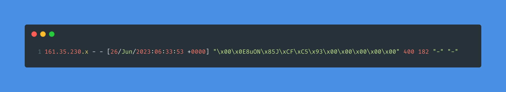
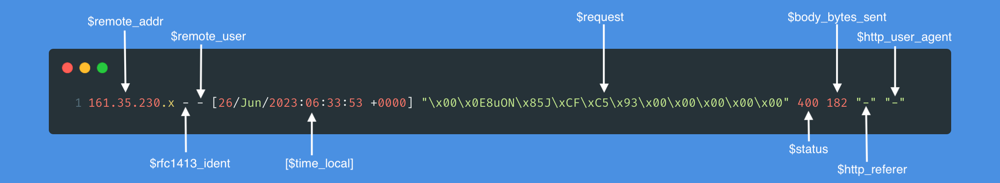
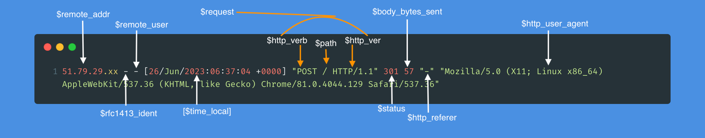

# Visualizing Nginx Access Logs using Grafana
In my last [blog post](https://www.timeplus.com/post/analyzing-nginx-access-logs), I showed how Timeplus Proton can be used to analyze web traffic in production using just the log files generated by an Nginx web server. The article explored real-time analysis and historical analysis but the analysis wasn't visualized. 

This article will remedy the lack of rich visualizations by showing how to do so using open source tools like [Grafana](https://grafana.com/).


## Prerequisites
In addition to Timeplus Proton, the previous article used the following technologies: 
* [Amazon Virtual Private Cloud](https://aws.amazon.com/vpc/) (VPC);
* [Amazon Elastic Compute Cloud](https://aws.amazon.com/ec2/) (EC2);
* [NFS](https://en.wikipedia.org/wiki/Network_File_System);
* [IPinfo](https://ipinfo.io/);
* [Ghost](https://ghost.org/);
* [Nginx](https://nginx.org/en/).
  
The first two require access to an AWS account. The last two products need to have been running in production, in order to have meaningful access log data to experiment with. 

This article builds on the same analysis of the previous article but is quicker to get started as you only need: 
* [Docker](https://docs.docker.com/engine/install/) installed;
* an [IPinfo](https://ipinfo.io/) account. 

Timeplus Proton has a handy feature [`RANDOM STREAM`](https://docs.timeplus.com/proton-create-stream#create-random-stream) which we will use to generate all the access log data needed for experimentation in this article. 

Before I dive into the article proper, I will first revisit the format used by Nginx to record access log data so that the data we'll generate will mimic its shape and properties.

## The Shape of Nginx's Access Log Data
In the [previous article](https://www.timeplus.com/post/analyzing-nginx-access-logs), we briefly touched on the Nginx access logs but did not dwell on its location or how the data it contains should be parsed.

### Nginx Access Log Data
The access logs for Nginx are typically written to the file `/var/log/nginx/access.log`. Here's an excerpt from my blog's access logs:
```bash
161.35.230.x - - [26/Jun/2023:06:33:53 +0000] "\x00\x0E8uON\x85J\xCF\xC5\x93\x00\x00\x00\x00\x00" 400 182 "-" "-"
51.79.29.xx - - [26/Jun/2023:06:37:04 +0000] "POST / HTTP/1.1" 301 57 "-" "Mozilla/5.0 (X11; Linux x86_64) AppleWebKit/537.36 (KHTML, like Gecko) Chrome/81.0.4044.129 Safari/537.36"
179.43.177.xxx - - [26/Jun/2023:06:45:28 +0000] "GET / HTTP/1.1" 301 60 "-" "Hello World"
87.236.176.xxx - - [26/Jun/2023:07:58:36 +0000] "GET / HTTP/1.1" 200 6364 "https://www.ayewo.com/" "Mozilla/5.0 (compatible; InternetMeasurement/1.0; +https://internet-measurement.com/)"
87.236.176.xxx - - [26/Jun/2023:07:58:38 +0000] "GET /favicon.png HTTP/2.0" 200 7636 "-" "Mozilla/5.0 (compatible; InternetMeasurement/1.0; +https://internet-measurement.com/)"
93.126.72.xxx - - [26/Jun/2023:08:29:38 +0000] "GET /how-to-install-rsync-on-windows/ HTTP/2.0" 200 6394 "https://www.google.com/" "Mozilla/5.0 (Windows NT 10.0; Win64; x64) AppleWebKit/537.36 (KHTML, like Gecko) Chrome/114.0.0.0 Safari/537.36"
```

The first line in the access log is from the IP address `161.35.230.x`. 



We'll look at the Nginx access log format to understand what each field on that line means.

### Nginx Access Log Format
Nginx's [access log format](https://docs.nginx.com/nginx/admin-guide/monitoring/logging/#setting-up-the-access-log) is specified in `/etc/nginx/nginx.conf` and it broadly looks like this:
```bash
http {
    log_format compression '$remote_addr - $remote_user [$time_local] '
                           '"$request" $status $body_bytes_sent '
                           '"$http_referer" "$http_user_agent"';

    server {
        access_log /var/log/nginx/access.log;
        ...
    }
}
```

Here's the first line we saw earlier, but this time annotated to show individual fields from the log format.



We can see that the log format uses a single space as separator between fields. 

To parse that line reliably, we can use this Python regex:
```python
import re

line = '161.35.230.x - - [26/Jun/2023:06:33:53 +0000] "\x00\x0E8uON\x85J\xCF\xC5\x93\x00\x00\x00\x00\x00" 400 182 "-" "-"'

malicious_pattern = re.compile(r'(?P<remote_addr>\S+).(?P<rfc1413_ident>\S+).(?P<remote_user>\S+).\[(?P<time_local>[^\]]+)\] "(?P<request>[^"]*)" (?P<status>\d+) (?P<body_bytes_sent>\d+) "(?P<http_referer>[^"]*)" "(?P<http_user_agent>[^"]*)"')
match = malicious_pattern.match(line)
```

The results of parsing the first line are shown in the table below:
|  #   | Field | Value |
|------|--------|------------------|
| 1 | `$remote_addr` | 161.35.230.x |
| 2 | `$rfc1413_ident` | - |
| 3 | `$remote_user` | - |
| 4 | `$time_local` | 26/Jun/2023:06:33:53 +0000 |
| 5 | `$request` | \x00\x0E8uON\x85J\xCF\xC5\x93\x00\x00\x00\x00\x00 |
| 6 | `$status` | 400 |
| 7 | `$body_bytes_sent` | 182 |
| 8 | `$http_referer` | - |
| 9 | `$http_user_agent` | - |

It has total of 9 fields which will be represented as 9 database columns later. 

It is clear from looking at the contents of the 5th field i.e. `$request` that this was a maliciously crafted request. The `$request` didn't specify a valid [HTTP protocol](https://www.rfc-editor.org/rfc/rfc9110) method (e.g. `GET`, `POST` or `OPTIONS`) to the server which is why the server responded with a HTTP `$status` code of 400 (Bad Request).

Let's use the Python regex to parse the second line:
|  #   | Field | Value |
|------|--------|------------------|
| 1 | `$remote_addr` | 51.79.29.xx |
| 2 | `$rfc1413_ident` | - |
| 3 | `$remote_user` | - |
| 4 | `$time_local` | 26/Jun/2023:06:37:04 +0000 |
| 5 | `$request` | POST / HTTP/1.1 |
| 6 | `$status` | 301 |
| 7 | `$body_bytes_sent` | 57 |
| 8 | `$http_referer` | - |
| 9 | `$http_user_agent` | Mozilla/5.0 (X11; Linux x86_64) AppleWebKit/537.36 (KHTML, like Gecko) Chrome/81.0.4044.129 Safari/537.36 |

Unlike the first line, the `$request` field parsed from the second line contains a request string that is valid under the HTTP protocol. 

Here's the second line again annotated to show the `$request` field and its 3 parts (in orange):


The `$request` field also uses a single space as delimiter and can be split into three parts:
* `POST`: indicates the HTTP verb or method
* `/`: indicates the request URI (Uniform Resource Identifier) or path
* `HTTP/1.1`: indicates the HTTP protocol version in use for the request


One of the analysis which we will run later on Timeplus Proton is a fast aggregation query that will show the top requested pages indicated by the `$path` field in the access logs. We could store each `$request` field in a single database column named `request`, but it would be super convenient if we split the `$request` field into 3 separate columns named: `http_method`, `path` and `http_version`.


If we apply the following modifications to our Python regex:
```python
import re

line = '51.79.29.xx - - [26/Jun/2023:06:37:04 +0000] "POST / HTTP/1.1" 301 57 "-" "Mozilla/5.0 (X11; Linux x86_64) AppleWebKit/537.36 (KHTML, like Gecko) Chrome/81.0.4044.129 Safari/537.36"'

pattern = re.compile(r'(?P<remote_addr>\S+).(?P<rfc1413_ident>\S+).(?P<remote_user>\S+).\[(?P<time_local>\S+ \+[0-9]{4})]."(?P<http_method>\S+) (?P<path>\S+) (?P<http_version>\S+)" (?P<status>[0-9]+) (?P<body_bytes_sent>\S+) "(?P<http_referer>.*)" "(?P<http_user_agent>.*)"\s*\Z')
match = pattern.match(line)
```

We can use the updated Python regex to parse the 2nd line into 11 fields (the 1st line was parsed into 9 fields):
|  #   | Field | Value |
|------|--------|------------------|
| 1 | `$remote_addr` | 51.79.29.xx |
| 2 | `$rfc1413_ident` | - |
| 3 | `$remote_user` | - |
| 4 | `$time_local` | 26/Jun/2023:06:37:04 +0000 |
| 5 | `$http_method` | POST |
| 6 | `$path` | / |
| 7 | `$http_version` | HTTP/1.1 |
| 8 | `$status` | 301 |
| 9 | `$body_bytes_sent` | 57 |
| 10 | `$http_referer` | - |
| 11 | `$http_user_agent` | Mozilla/5.0 (X11; Linux x86_64) AppleWebKit/537.36 (KHTML, like Gecko) Chrome/81.0.4044.129 Safari/537.36 |


There are several malformed requests in the access logs similar to the one we saw on the 1st line. Many of them will not be parsed reliably using our updated Python regex, so we will add an additional database column called `malicious_request` to store such malformed `$request`s in full rather than attempt to split them. In fact, this was why we had a total of 12 columns in the `nginx_historical_access_log` stream created in the previous article.

Below is a brief overview of how the fields map to database columns:
* `$remote_addr` is stored in column `remote_ip` of type `ipv4`
* `-` is stored in column `rfc1413_ident` of type `string`
* `$remote_user` is stored in column `remote_user` of type `string`
* `$time_local` os stored in column `date_time` of type `datetime64`
* `$request` is split into 4 columns each of type `string` to make our analysis easier:
  * column `http_method` of type `string`
  * column `path` of type `string` and
  * column `http_version` of type `string`
  * column `malicious_request` of type `string` for any `$request` that fails to parse correctly
* `$status` is stored in column `status` of type `int`
* `$body_bytes_sent` is stored in column `size` of type `int`
* `$http_referer` is stored in column `referer` of type `string`
* `$http_user_agent` is stored in column `user_agent` of type `string`

With that out of the way, let's dive into this article proper!


## Docker Environment
The [`docker-compose.yaml`](docker-compose.yaml) file defines 3 containers:
* a Timeplus Proton container;
* a Grafana container;
* a third container that seeds the Timeplus Proton container with access log data.

### DDL Overview
The 3rd container uses the `proton client` to seed the Timeplus Proton database with access log data from an SQL file: 
* [`01_nginx-access-log.sql`](01_nginx-access-log.sql). 

The SQL file contains the following DDL:


### Generating Data to Mimic Nginx Access Data
On line 3, the [`CREATE RANDOM STREAM`](https://docs.timeplus.com/proton-create-stream#create-random-stream) DDL is used to create a random stream named `nginx_access_log`. 

Each column is randomly assigned a `default` value as you can see on lines 4 - 30.

The table below goes over each of the 12 columns and the database [functions](https://docs.timeplus.com/functions) used to generate test data.
| #  | Column | Generated Data | 
|------|--------|------------------|
|1 | `remote_ip` | [`random_in_type('ipv4')`](https://docs.timeplus.com/functions_for_random#random_in_type): returns a random [ipv4](https://docs.timeplus.com/datatypes) representing a user's IP address. |
| 2 | `rfc1413_ident` | `default`s to '-' but should be a string conforming to [RFC1413](https://datatracker.ietf.org/doc/html/rfc1413). Currently unused. |
| 3 | `remote_user` | `default`s to '-' since most blog traffic is from unauthenticated users. Currently unused. |
| 4 | `date_time` | `random_in_type('datetime64', 365, y -> to_time('2023-6-17') + interval y day)`: [`random_in_type('datetime64')`](https://docs.timeplus.com/functions_for_random#random_in_type) between 2023-6-17 & a 1-yr interval i.e. [2023-06-17, 2024-06-17). |
| 5 | `http_method` | `['GET', 'POST', 'PUT', 'DELETE', 'HEAD'][rand()%5]`: uses [`rand()`](https://docs.timeplus.com/functions_for_random#rand) to return a random index between [0, 5) in this 5-element array. The array samples 5 of the [39 HTTP verbs](https://stackoverflow.com/questions/41411152/how-many-http-verbs-are-there). |
| 6 | `path` | `['/rss/', '/', '/sitemap.xml', '/favicon.ico', '/robots.txt', ...][rand()%11]`: uses [`rand()`](https://docs.timeplus.com/functions_for_random#rand) to return a random index between [0, 11) in this 11-element array of sample URL subpaths. |
| 7 | `http_version` | `['HTTP/1.0', 'HTTP/1.1', 'HTTP/2.0'][rand()%3]`: similar to `path`. |
| 8 | `status` | `[200, 301, 302, 304, 400, 404][rand()%6]`: similar to `path`. |
| 9 | `size` | `rand()%5000000`: uses `rand()` to generate a random amount of [bytes sent](https://stackoverflow.com/a/30837653), up to `~5MB`. |
| 10 | `referer` | `['-', 'https://ayewo.com/', '...', 'https://google.com/'][rand()%4]`: similar to `path`. |
| 11 | `user_agent` | `['...', '...', ...][rand()%14]`: similar to `path`. |
| 12 | `malicious_request` | `if(rand()%100 < 5, '\x16\...', '')`: returns a malformed sequence whenever `rand()%100` is < 5. |
  


### Random Streams
There is an important note about the design of random streams in Timeplus Proton mentioned in the [`RANDOM STREAM`](https://docs.timeplus.com/proton-create-stream#create-random-stream) documentation that is worth highlighting here:
> [!NOTE]
> The data of random stream is kept in memory during the query time. If you are not querying the random stream, there is no data generated or kept in memory.

Essentially, each time you run a query like `SELECT remote_ip, rfc1413_ident, remote_user, date_time, http_verb, path, http_ver, status, size, referer, user_agent, malicious_request FROM nginx_access_log LIMIT 1;`, you'll get a different (random) result from the stream.

For instance, running that query yields the following output:
```sql
SELECT
  remote_ip, rfc1413_ident, remote_user, date_time, http_verb, path, http_ver, status, size, referer, user_agent, malicious_request
FROM
  nginx_access_log
LIMIT 1

Query id: d4b7f92c-bcd8-42ec-94ef-655eae86861b

┌─remote_ip─────┬─rfc1413_ident─┬─remote_user─┬───────────────date_time─┬─http_verb─┬─path─────────┬─http_ver─┬─status─┬──size─┬─referer─┬─user_agent────┬─malicious_request─┐
│ 181.12.95.134 │ -             │ -           │ 2024-05-02 00:00:00.000 │           │ /sitemap.xml │          │    302 │ 21345 │ -       │ Plenary/4.6.2 │                   │
└───────────────┴───────────────┴─────────────┴─────────────────────────┴───────────┴──────────────┴──────────┴────────┴───────┴─────────┴───────────────┴───────────────────┘

1 row in set. Elapsed: 0.012 sec.
```

Running it again, yields this output:
```sql
SELECT
  remote_ip, rfc1413_ident, remote_user, date_time, http_verb, path, http_ver, status, size, referer, user_agent, malicious_request
FROM
  nginx_access_log
LIMIT 1

Query id: 11d071e4-6028-47da-826d-9db42176f8e5

┌─remote_ip──────┬─rfc1413_ident─┬─remote_user─┬───────────────date_time─┬─http_verb─┬─path─────────┬─http_ver─┬─status─┬──size─┬─referer────────────┬─user_agent─────────────────────────────────────────┬─malicious_request─┐
│ 204.25.223.210 │ -             │ -           │ 2024-05-15 00:00:00.000 │ POST      │ /favicon.ico │ HTTP/1.1 │    301 │ 32062 │ https://ayewo.com/ │ NetNewsWire (RSS Reader; https://netnewswire.com/) │                   │
└────────────────┴───────────────┴─────────────┴─────────────────────────┴───────────┴──────────────┴──────────┴────────┴───────┴────────────────────┴────────────────────────────────────────────────────┴───────────────────┘

1 row in set. Elapsed: 0.013 sec. 
```

Due to this design decision, we will need to create a snapshot from the random stream to serve as our test data. This snapshot will represent our access log data so we can reliably geolocate the latitude and longitude of each (randomly generated) IP address before we can correctly visualize them in Grafana.

Afterwards, the article will use the random stream to illustrate streaming queries in Grafana.


