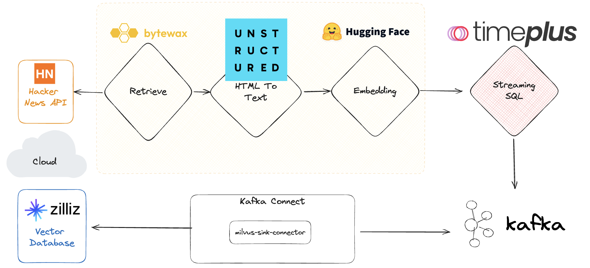
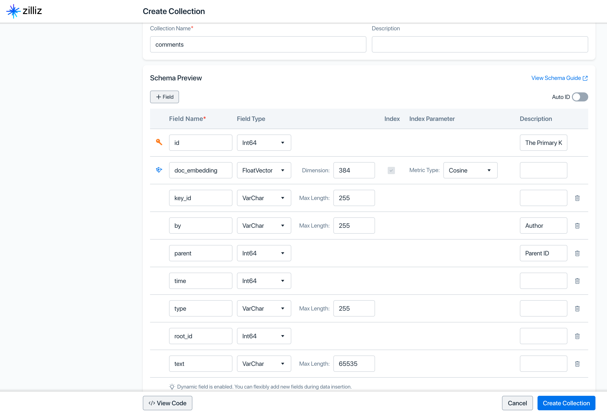

# Streaming LLM With Timeplus and Zilliz

> [!NOTE]
> This demo project is largely based on the great work from Bytewax: https://bytewax.io/blog/stream-process-embed-repeat

## Dataflow



- Input - stream stories and comments from [HackerNews API](https://github.com/HackerNews/API).
- Pre-process - retrieve updates and filter for stories/comments via [bytewax](https://bytewax.io).
- Retrieve Content - download the html and parse it into usable text. Thanks to awesome [Unstructured.io](https://github.com/Unstructured-IO/unstructured).
- Vectorize - Create an embedding or list of embeddings for text using [Hugging Face Transformers](https://huggingface.co/sentence-transformers/all-MiniLM-L6-v2).
- Output - write the JSON document with embeddings and other fields to a local [Timeplus Proton](https://github.com/timeplus-io/proton) server, into the data streams.
- Filter/Route - use streaming SQL to filter/transform JSON data and send output to a local Kafka server.
- Forward - use [milvus plugin for Kafka Connect](https://github.com/zilliztech/kafka-connect-milvus) to forward the data to Zilliz Cloud.
- Query - build a [streamlit](https://streamlit.io/) web application to query the live data with the same embedding model.

## Setting up your environment

### Python

Recommended with Python 3.11 and a venv.

```bash
python3.11 -m venv py311
source py311/bin/activate
pip install -r requirements.txt
```

### Timeplus Proton

It's recommended to install Timeplus Proton as a binary, instead as a Docker container. So that it can connect to the local Kafka server without extra configuration.

Create a new folder and run following commands

```bash
curl https://install.timeplus.com | sh
proton server
```

### Apache Kafka and Kafka Connect

You don't have to setup Kafka, if you only want to run SQL to scan the hacker news data. You can load JSON documents to Timeplus Proton with embedding first. The Kafka and Kafka Connect are required when you want to forward the data to Zilliz Cloud.

## Run it

```bash
python -m bytewax.run "pipeline:run_hn_flow()"
```

Some debug logs will be printed out. Then you can check the live data in Timeplus Proton via streaming SQL.

```bash
proton client
```

This will open the Proton Command Line Client. Run this SQL to explore the live data:

```sql
SELECT * FROM hn_comments_raw
```

The entire JSON document, including the long embedding array, is saved as a single string column. Timeplus Proton provides easy ways to extract value from JSON document, e.g.

```sql
SELECT
raw:key_id, raw:by, raw:id, raw:parent, raw:time, raw:type, raw:root_id, raw:text
FROM hn_comments_raw;

SELECT cast(raw:doc_embedding,'array(float32)') AS doc_embedding FROM hn_comments_raw;
```

## Set Up Kafka and Zilliz

In [the original Bytewax demo app](https://github.com/bytewax/real-time-milvus/), Milvus Lite is used to run Milvus easily in Python applications. While in this example, we are integrating with the managed Milvus in the cloud, i.e. Zilliz Cloud.

Timeplus Proton will write transformed data to Kafka topics. Then the data is forwarded to Zilliz Cloud via https://github.com/zilliztech/kafka-connect-milvus

Please follow the kafka-connect-milvus [docs](https://github.com/zilliztech/kafka-connect-milvus/blob/main/README_OSS.md) for detailed installation steps. In short, you need:

- Setup JVM
- Install Apache Kafka with Kafka Connect, such as `kafka_2.13-3.6.1`
- Put `zilliz-kafka-connect-milvus-0.1.1` folder in `kafka_2.13-3.6.1\libs\`
- Edit the `milvus-sink-connector.properties` file with proper Milvus/Zilliz endpoint and token. Then put it in `kafka_2.13-3.6.1\config\`:

```properties
name=zilliz-kafka-connect-milvus
connector.class=com.milvus.io.kafka.MilvusSinkConnector
public.endpoint=https://THE_ID.api.gcp-us-west1.zillizcloud.com
token=THE_TOKEN
collection.name=comments
topics=comments
```

Please note the a collection is created in Zilliz Cloud with the following schema:


## Start the Kafka stack

Open a terminal window and change directory to `kafka_2.13-3.6.1`, then

1. Start the ZooKeeper service via `bin/zookeeper-server-start.sh config/zookeeper.properties`
2. Start the Kafka broker service via `bin/kafka-server-start.sh config/server.properties`
3. Create a topic via `bin/kafka-topics.sh --create --topic comments --bootstrap-server localhost:9092`
4. Make sure you create a collection in Zilliz Cloud: `comments` with dimension=384
5. Start the Kafka Connect service via `bin/connect-standalone.sh config/connect-standalone.properties config/milvus-sink-connector.properties`

## Streaming ETL with Timeplus Proton

The following SQL statements will set up a pipeline to read all hacker news comments and send them to the Kafka topic. Via the `zilliz-kafka-connect-milvus` such live data will be immediately available in Zilliz Cloud.

```sql
CREATE EXTERNAL STREAM comments_topic(
  key_id string, by string, id int64, parent int64, time int64, type string,
  root_id int64, text string, doc_embedding array(float32))
SETTINGS type='kafka', brokers='localhost:9092',
         topic='comments', data_format='JSONEachRow', one_message_per_row=true;

CREATE MATERIALIZED VIEW mv INTO comments_topic AS
  SELECT
  raw:key_id as key_id, raw:by as by, raw:id::int64 as id, raw:parent::int64 as parent, raw:time::int64 as time, raw:type as type, raw:root_id::int64 as root_id, raw:text as text, cast(raw:doc_embedding,'array(float32)') AS doc_embedding
  FROM hn_comments_raw WHERE _tp_time>earliest_ts();
```

You can even do some filters in Timeplus Proton, to only send interested contents with embedding to Zilliz, such as changing the MATERIALIZED VIEW and adding the following to the end of the MATERIALIZED VIEW.

```sql
WHERE text ilike '%play%'
```

## Build a Web UI

A streamlit app is available in this repo. Simply run this commmand with the venv activated:

```bash
streamlit run ui.py
```

It will read the configuration from `milvus-sink-connector.properties` file. Make sure you change the endpoint and token for Milvus or Zilliz.

## Wrap Up

In this app, we demonstrated how to load real-time hackernews feed via Python and Bytewax, generate vector embeddings via Hugging Face Transformers, send the JSON documents to Timeplus Proton. You can apply SQL-based filter/transformation in Timeplus, then write to Kafka/Zilliz. By doing so, you'll get fresh data from internet, make the data ready for your awesome LLM applications. Happy streaming and Happy LLM!
